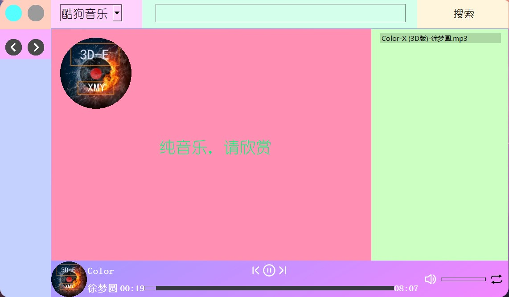

# get-music-lizhanqi-gui
- 使用get-music-lizhanqi为后端制作的音乐播放下载一体的qt程序
- 如果你觉得源代码运行起来太麻烦，你可以下载打包好的可执行文件:[123pan](https://www.123pan.com/s/SivKVv-dY8JH)    [百度网盘](https://pan.baidu.com/s/1qRaNT_XdfPvOIFSWG5D-SA?pwd=love)

## 第一次使用时
- 由于没有创建music文件夹或music文件夹为空，都会进入引导，引导界面不要直接点击播放，要再下载完歌曲之后再播放
  

## 下载了一首歌之后
- 并重启打开后，右侧的使用说明就没了，接下来就可以愉快的享受歌曲的带来的快乐了


如果你想了解[get-music-lizhanqi](https://github.com/lzq-hopego/get-music-lizhanqi)请移步，他也是我的项目，也是这个qt页面的后端

## 使用安装

pip安装需要的依赖即可，暂不支持python3.11和python3.7以下的版本

需要你安装以下第三方库
```
opencv-python
get-music-lizhanqi==1.0.9 #它的版本要大于1.0.8，否则网易云接口无法下载歌词
pyqt5
```

一、opencv

使用它的主要目的是实现封面的旋转，再参考众多资料和文章中发现无法将图片切成圆形并在qt中实现旋转(本人太菜)，因此采用的opencv中提供的旋转功能并保存在music文件夹下名为test.jpg，所以你如果开启封面选装将会无比的消耗内存和磁盘寿命，影响不太大，以后技术达到了就行修复这一bug

二、get-music-lizhanqi

这个库出自我手，项目地址:[get-music-lizhanqi](https://github.com/lzq-hopego/get-music-lizhanqi)，这个库提供了9个歌曲下载接口，所以本项目采用它

三、pyqt5

老生常谈了，python的tk设计不了太好看的ui，所以采用pyqt5，当然如没有那么多的需求的话，可以用get-music-lizhanqi库提供音乐下载ui它采用的正是tk

## 使用

下载后双击test2.py就可以运行，运行时如果music文件夹没有音乐，那么会生成一句提醒的话，但你搜索下载完歌曲后再重新打开时那一句提醒就会消失，暂时也不支持在程序中直接删除歌曲需要你在自己在music文件夹中删除,如果你不能保证music文件夹里是否有音乐文件，那么请不要删除项目中**使用说明-开发者.mp3**

## 退出

左上角蓝色的按钮是退出

## 最小化

左上角灰色的按钮是最小化，最小化至任务栏进行后台播放

## 添加歌曲

直接将您的歌曲复制到本程序所在的music文件夹中即可，删除也是直接在music文件夹中删除即可，删除和添加后都要重启一下即可，，做的太匆忙了

## 下载歌曲

程序中上方提供了一个搜索框用来搜索歌曲的，这里面你可以填歌手，歌名，以及部分歌词进行模糊搜索，点击搜索之后，双击你想下载的歌曲等待下载完成，下载完成后会自动添加到当前歌单，歌曲的下载位置在music文件夹

## 搜索界面和歌词界面的切换

程序的左上方有两个左右方向的图标，右图标是切换到搜索界面，左图标是切换到歌词界面

## 上下切换歌曲

页面的下方有暂停和上下切换的图标可进行歌曲的上下换，同时也可双击右侧的歌单中的某一首歌进行播放

## 歌曲播放模式

在右下角提供了三种播放模式，可供调整点击一下即可切换，歌单顺序循环、随机播放、单曲循环

## 音量

这里的音量调节的是音乐的音量不是系统的音量

## 歌曲进度

你可以通过调整歌曲的进度条来调整歌曲的播放进度

## 封面旋转

点击歌词旁边的大封面可控制封面的转动

## 更新记录
- 2023-01-26 修复歌曲名中多个‘-’时无法正确显示歌曲名的问题，修复切换歌曲时封面旋转角度不对的问题，优化进度条
- 2023-01-23 修复在随机播放模式下当前播放的音乐索引错误的问题，修复播放模式切换打印模式错误的问题
- 2022-11-29 修复搜索音乐时假死的问题
- 2022-11-28 修复下载时窗口无法拖动或下载音乐时网络不好导致程序假死

## 遗憾
- 由于qq接口下载的是m4a格式的歌曲，该软件会强制将其保存为mp3格式，但是原本m4a的信息需要支持m4a播放器的软件才能解析，即使强制修改格式也不行，需要格式转换软件，而本程序使用音频播放器是 ** QMediaPlayer ** 这个播放器并不支持m4a音频的解析，目前唯有使用其他播放器重构才能解决此问题

## 注意事项
**需要注意的是本程序的歌单是由music文件夹创建的所以请不要尝试删掉它**

**二次创作需要加上本作者的水印，不可商用**

**不可以做任何商业用途，如有侵权，联系我删除**


开发者邮箱：3101978435@qq.com

**注意下载时，不要下载和当前播放的歌曲名字一样的音乐，这会让qt陷入死循环**
