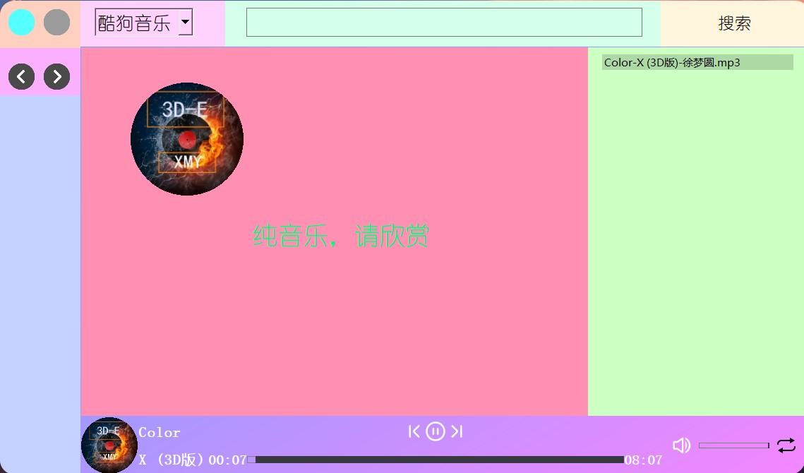

# get-music-lizhanqi-gui
使用get-music-lizhanqi为后端制作的音乐播放下载一体的qt程序
需要你安装第三以下方库
```
opencv-python
get-music-lizhanqi
pyqt5
```


如果你想了解get-music-lizhanqi怎么实现和怎么使用的请移步到我的主页查看他，他也是我的项目

下载后双击test2.py就可以运行，运行时如果music文件夹没有音乐，那么会生成一句提醒的话，但你搜索下载完歌曲后再重新打开时那一句提醒就会消失，暂时也不支持在程序中直接删除歌曲需要你在自己在music文件夹中删除
注意下载时，不要下载和当前播放的歌曲名字一样的音乐，这会让qt陷入死循环
